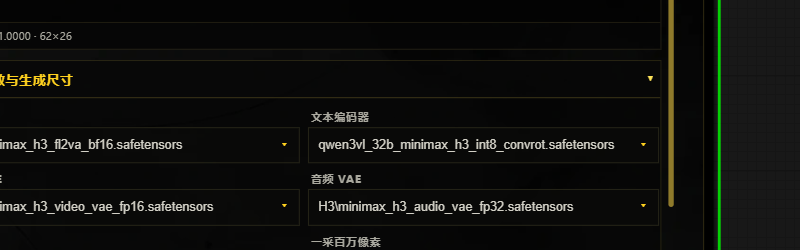

# 南风 H3 V10 for ComfyUI / NanFeng H3 V10 for ComfyUI

> **一个节点，串起多参考素材、智能分镜、音频驱动与连续二采。** 这是我为 MiniMax H3 制作的非官方 ComfyUI 一体化工作台：把原本分散的模型、LoRA、参考图/视频/音频、提示词分段、Sigma 与二采参数收进同一块高密度节点界面。
>
> **One node for multi-reference media, AI storyboards, audio-driven segmentation, and continuous second-pass generation.** This is my unofficial all-in-one ComfyUI workstation for MiniMax H3, bringing models, LoRAs, image/video/audio references, segmented prompts, Sigma controls, and second-pass settings into one dense node UI.

**非官方项目 / Unofficial project.** 本仓库不包含模型权重，不隶属于、不代表也未获得 MiniMax、ComfyUI 或其他第三方的官方背书。

[中文说明](#中文说明) · [English](#english) · [下载 Release](https://github.com/wwjjqq888888-pixel/nanfeng-h3-comfyui/releases/latest)

## 实机界面 / Real UI

下图来自实际运行中的 ComfyUI V10 工作流；截图经过裁切，不含 API Key、私人路径或私有媒体。

The images below come from a live ComfyUI V10 workflow. They are cropped to exclude API keys, private paths, and private media.

| 主工作区 / Main workspace | 模型与尺寸控制 / Model & size controls |
|---|---|
|  |  |

---

# 中文说明

## V10 有什么

- **多参考统一工作区**：在同一节点组织图片、视频、音频与分段提示词，保持固定素材槽位和引用关系。
- **智能分镜**：视觉模型与文本模型独立配置；原始创意独立保存，生成结果追加而不覆盖；支持分段、换图、删除、拖动换位和顺序提交。
- **智能音频驱动**：音频与内部分镜一一对应；按段裁切，末段可向上取整并补静音；音频驱动 API 使用独立配置，不与普通智能分镜凭据混用。
- **NativeAudioLock**：锁音频时直接输出精确源音频区间；未满足音频锁定条件时阻止错误生成。
- **连续一采/二采**：共享 ModelPatcher、动态 LoRA 链、强度与注意力链；支持完整 Sigma 轨迹、独立一采 Sigma 和潜空间二采。
- **Sigma 预设**：内置预设受保护，自定义预设可新建、切换、持久化和删除，并同步可见文本、底层值与采样步数。
- **恒定触发词**：独立单行输入；每段按“恒定触发词 + 单换行 + 分镜提示词”组合，留空时不会产生顶头空行。
- **可移植运行时**：Skill、前端资源和配置均按节点目录相对解析，不依赖作者机器的绝对路径。
- **双 Skill 边界**：常规智能分镜 Skill 与 NS 分镜 Skill 作为两个独立目录随 V10 发布；请根据自己的使用场景、平台规则与当地法律合规使用。

## 节点

- 节点 ID：`NanFengH3MultiReferenceGeneratorV10`
- 搜索标题：`南风H3 V10 多参视频生成`
- 界面语言：**中文优先**，目前没有完整的运行时中英文切换。
- 提示词输入：可输入中文或英文；最终理解质量取决于所连接的模型。

## 安装

进入 `ComfyUI/custom_nodes/` 后执行：

```bash
git clone https://github.com/wwjjqq888888-pixel/nanfeng-h3-comfyui.git nanfeng_prompt_nodes_v10
```

然后重启 ComfyUI，并在浏览器中执行 `Ctrl+F5` 强制刷新。

### 从旧版覆盖升级

1. 等待当前任务结束并退出 ComfyUI。
2. 下载最新 Release 中的升级 ZIP。
3. 将 ZIP 内唯一顶层目录 `nanfeng_prompt_nodes_v10` 覆盖到 `ComfyUI/custom_nodes/`。
4. Release ZIP **不包含** `.env`、`.audio-drive.env` 或视觉分析缓存，不会抹掉你现有的本地凭据。
5. 重启 ComfyUI，执行 `Ctrl+F5`。

> V10 使用独立目录名 `nanfeng_prompt_nodes_v10`。若你保留旧版做 A/B，请避免同时加载会注册相同节点 ID 的重复副本。

## API 配置

首次安装可把 `.env.example` 复制为 `.env`，再填写你自己的视觉与文本模型配置。智能音频驱动的独立配置由节点界面写入本地 `.audio-drive.env`。这些真实配置文件均被 Git 和 Release 排除。

## 模型目录

```text
ComfyUI/models/diffusion_models/H3/       # H3 Ref2VA / FL2VA
ComfyUI/models/text_encoders/             # MiniMax H3 text encoder
ComfyUI/models/vae/                       # H3 video VAE + audio VAE
ComfyUI/models/latent_upscale_models/     # H3 3D latent upscaler
ComfyUI/models/loras/H3/                  # 可选 H3 LoRA
```

模型权重不随本仓库提供。请自行确认所用模型、LoRA 与 ComfyUI 扩展的许可证和兼容性。

## 语言支持

| 项目 | 状态 |
|---|---|
| 仓库文档 | 中文 + English |
| 节点 UI | 中文优先；暂无完整语言切换 |
| 提示词输入 | 支持中文或英文文本 |
| `@图片N` 等快捷引用 | 中文优先语法 |
| 模型理解效果 | 由用户选择的上游模型决定 |

## 隐私与安全

仓库和 Release 不包含模型、生成媒体、`.env`、`.audio-drive.env`、API Key、视觉分析缓存、`__pycache__` 或测试缓存。密钥只保存在用户本机节点目录的服务端配置中，不写入工作流 JSON。

---

# English

## What V10 includes

- **Unified multi-reference workspace:** organize image, video, audio, and segmented prompts inside one node while preserving stable media slots and references.
- **AI storyboard:** separate vision/text providers, independently preserved source idea, append-only generated results, segmented generation, image replacement/deletion/reordering, and sequential submission.
- **Audio-driven storyboards:** one audio interval per internal storyboard segment, per-segment slicing, optional rounded final duration with silence padding, and credentials isolated from the regular storyboard backend.
- **NativeAudioLock:** emits the exact source-audio interval when locked and blocks invalid generation when the audio-lock contract is incomplete.
- **Continuous first/second pass:** shared ModelPatcher, dynamic LoRA stack, strengths, attention chain, full Sigma trajectory, independent first-pass Sigma, and latent second-pass controls.
- **Persistent Sigma presets:** protected built-ins plus creatable, selectable, persistent, and deletable custom presets synchronized with visible values and sampling steps.
- **Constant trigger line:** prepends one stable line to every segment with exactly one newline and no leading blank line when empty.
- **Portable runtime:** Skills, frontend assets, and configuration paths resolve relative to the installed node directory—no author-specific absolute source path.
- **Two explicit Skill scopes:** the regular storyboard Skill and NS storyboard Skill ship as separate directories. Use them only in compliance with your platform rules and local law.

## Node identity

- Node ID: `NanFengH3MultiReferenceGeneratorV10`
- Search title: `南风H3 V10 多参视频生成`
- Runtime UI: **Chinese-first**; there is no complete runtime language switch yet.
- Prompt input: Chinese or English text is accepted; comprehension quality depends on the connected model.

## Install

Run inside `ComfyUI/custom_nodes/`:

```bash
git clone https://github.com/wwjjqq888888-pixel/nanfeng-h3-comfyui.git nanfeng_prompt_nodes_v10
```

Restart ComfyUI and press `Ctrl+F5` in the browser.

### In-place upgrade

1. Let active jobs finish and exit ComfyUI.
2. Download the latest Release ZIP.
3. Extract its single top-level `nanfeng_prompt_nodes_v10` directory into `ComfyUI/custom_nodes/`, overwriting the previous V10 folder.
4. The upgrade archive excludes `.env`, `.audio-drive.env`, and vision caches, so existing local credentials survive.
5. Restart ComfyUI and press `Ctrl+F5`.

## API configuration

For a clean install, copy `.env.example` to `.env` and enter your own vision/text provider settings. Audio-drive credentials use a separate local `.audio-drive.env` managed by the node UI. Live configuration files are excluded from Git and Release assets.

## Language support

| Surface | Support |
|---|---|
| Repository documentation | Chinese + English |
| Runtime node UI | Chinese-first; no complete language switch yet |
| Prompt input | Chinese or English text |
| Shortcuts such as `@图片N` | Chinese-first syntax |
| Model comprehension | Depends on the user's selected upstream model |

## Privacy, limitations, and licenses

No model weights, generated media, live credentials, vision-analysis cache, bytecode, or test cache are included. This extension depends on a compatible ComfyUI + MiniMax H3 environment. Model weights, ComfyUI, and third-party extensions retain their own licenses; this repository does not grant rights to redistribute them.

## Historical releases

V8.1, V6, and V4 remain available as historical tags and Releases. V10 is the current `main` branch and latest Release.
