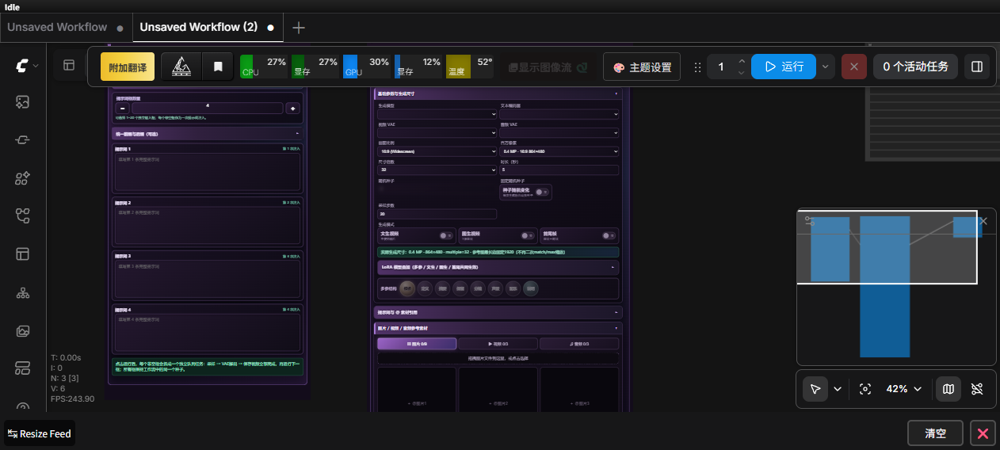
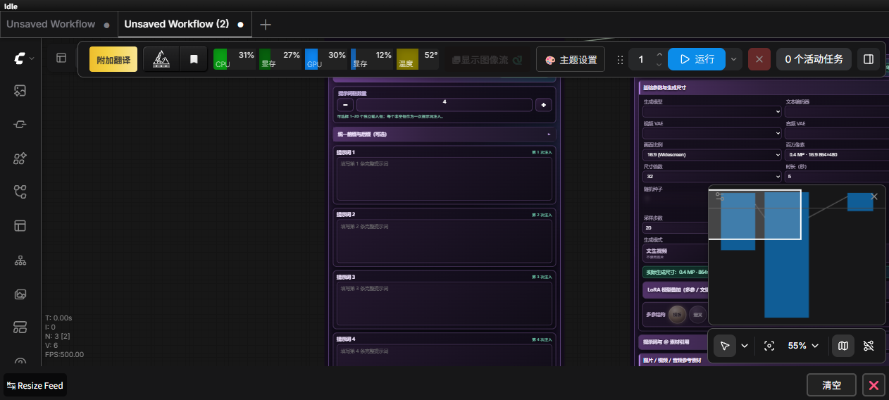

# 南风 H3 V4 for ComfyUI / NanFeng H3 V4 for ComfyUI

**中文说明** · **English documentation below**

> 面向 MiniMax H3 的 ComfyUI 自定义节点：采用类似 Seedance 2 的素材槽位与引用交互逻辑，把多模态参考、FL2VA、提示词列表、LoRA和可选加速集中在一个可视化工作流中。
>
> A ComfyUI custom-node suite for MiniMax H3. Its media-slot and reference interaction follows a Seedance 2-like workflow, bringing multimodal references, FL2VA, prompt-list jobs, LoRA, and optional acceleration controls into one visual workflow.

> **非官方项目 / Unofficial project.** 本项目只是借鉴和模拟类似 Seedance 2 的素材组织与引用方式；不包含 Seedance 2 模型或代码，也不隶属于或代表 ByteDance、Seedance、MiniMax或Comfy-Org。
>
> This project only borrows and simulates a Seedance 2-like media organization and reference workflow. It contains no Seedance 2 model or code and is not affiliated with or endorsed by ByteDance, Seedance, MiniMax, or Comfy-Org.

## 节点截图 / Node Screenshots

### 南风 H3 多参视频生成 V4 / NanFeng H3 Multi-Reference Generator V4



截图展示脱敏后的基础参数和图片/视频/音频素材槽位；模型路径和私人素材均为空。

The screenshot shows sanitized base controls and image/video/audio media slots. Local checkpoint paths and private media are blank.

### 南风提示词列表 / NanFeng Prompt List



四个非空提示词框会拆成四个独立顶层任务，严格从上到下排队；空框自动跳过。

Each non-empty prompt box becomes an independent top-level queue job in strict top-to-bottom order; empty boxes are skipped.

---

# 中文说明

## 为什么说“类似 Seedance 2 的逻辑”

这里说的是**交互与素材组织逻辑**，不是模型兼容、代码移植或官方合作：

1. 用编号素材槽位组织图片、视频和音频；
2. 素材按槽位顺序稳定编号；
3. 提示词中用`@图片1`、`@视频1`、`@音频1`引用对应素材；
4. 节点执行时将这些引用转换成MiniMax H3原生的`<Picture 1>`、`<Video 1>`、`<Audio 1>`标签；
5. 一个可视化主节点集中处理模式、比例、时长、素材、LoRA、采样与可选加速。

因此可以介绍为：

> **“采用类似Seedance 2的编号素材槽位和提示词引用逻辑，为MiniMax H3提供一体化ComfyUI工作流。”**

不能介绍成Seedance 2节点、Seedance 2模型移植或官方联合项目。

## 主要功能

- **南风H3多参视频生成V4**：封装MiniMax H3模型加载、条件构建、采样和音视频解码。
- **Ref2VA多模态参考**：最多9张图片、3个视频、3段音频。
- **FL2VA模式**：文生视频、首帧图生视频、首尾帧模式互斥切换。
- **素材引用**：输入`@图片1`等引用，自动转换为H3原生多模态标签。
- **南风提示词列表**：多个提示词拆成独立任务，按框从上到下执行。
- **LoRA**：最多3组模型LoRA，默认关闭。
- **可选加速**：支持已安装环境中的SageAttention、Sol-Attn和MiniMax H3 Block Cache（T8）。
- **Sigma V4**：可关闭的Sigma Shift、低Sigma加密、手动Sigma和可选双阶段采样。
- **安全尺寸**：`原图比例`只读取首帧宽高比，像素面积仍由`百万像素`控制；参考图最长边不超过1920，较小原图不放大。
- 保留V1–V4节点类ID，尽量兼容旧工作流。

## 中英文支持情况

| 项目 | 当前支持情况 |
|---|---|
| GitHub主页 | 完整中文 + 完整英文 |
| 安装与发布说明 | 中文 + English |
| ComfyUI节点界面 | **中文优先，当前没有完整的中英文UI切换** |
| 提示词内容 | 可输入中文或英文 |
| `@素材`快捷引用 | 当前使用中文快捷词：`@图片`、`@视频`、`@音频` |
| 生成理解能力 | 取决于MiniMax H3文本编码器与模型能力 |

这里不会虚假声称节点UI已经完全双语。英文用户可以按照下方英文说明使用；后续可以再开发真正的UI语言切换。

## 环境要求

- 支持MiniMax H3原生节点的较新版本ComfyUI；
- 用户自行准备MiniMax H3扩散模型、文本编码器、视频VAE和音频VAE；
- 工作流视频保存依赖**ComfyUI-VideoHelperSuite**的`VHS_VideoCombine`；
- SageAttention、Sol-Attn和T8都是可选项。未安装时保持关闭，并把SageAttention设为`disabled`。

## 安装

进入`ComfyUI/custom_nodes/`：

```bash
git clone https://github.com/wwjjqq888888-pixel/nanfeng-h3-comfyui.git nanfeng_prompt_nodes
```

重启ComfyUI，按`Ctrl+F5`，然后导入：

```text
workflows/南风H3V4.json
```

也可以从[Releases](https://github.com/wwjjqq888888-pixel/nanfeng-h3-comfyui/releases)下载ZIP。详细步骤见[中文安装说明](docs/INSTALL.zh-CN.md)。

## 模型目录

```text
ComfyUI/models/diffusion_models/   # H3 Ref2VA / FL2VA
ComfyUI/models/text_encoders/      # MiniMax H3 text encoder
ComfyUI/models/vae/                # H3 video VAE + audio VAE
ComfyUI/models/loras/              # Optional LoRAs
```

节点下拉框读取接收方本机目录；仓库和工作流不会写死作者路径，也不包含模型权重。

## 隐私与限制

- 工作流已清除作者模型选择、LoRA名称、素材、提示词、历史预览路径和随机种子；
- `原图比例`只适用于图生视频和首尾帧；
- LoRA启用时，V4 Sigma实验路径自动关闭；
- 加速后端可能改变速度、显存和输出，应固定Seed做A/B；
- ComfyUI按位置序列化Widget，扩展节点时不要删除或插入旧字段；
- 本项目不附带模型权重，各模型和第三方插件遵守各自许可证。

---

# English

## What “Seedance 2-like logic” means

This describes the **interaction and media-organization workflow only**. It does not claim model compatibility, code reuse, or an official partnership:

1. Numbered slots organize images, videos, and audio;
2. Media receives stable indexes in slot order;
3. Prompts reference assets with `@图片1`, `@视频1`, and `@音频1`;
4. At execution time, the node converts those references into MiniMax H3-native `<Picture 1>`, `<Video 1>`, and `<Audio 1>` tags;
5. One visual generator node centralizes mode, aspect ratio, duration, media, LoRA, sampling, and optional acceleration controls.

A precise project description is:

> **“A unified MiniMax H3 ComfyUI workflow using Seedance 2-like numbered media slots and prompt-reference interactions.”**

It must not be described as a Seedance 2 node, a port of the Seedance 2 model, or an official joint project.

## Features

- **NanFeng H3 Multi-Reference Generator V4:** wraps MiniMax H3 loading, conditioning, sampling, and audio/video decoding.
- **Ref2VA references:** up to 9 images, 3 videos, and 3 audio files.
- **FL2VA modes:** text-to-video, first-frame image-to-video, and first/last-frame generation.
- **Media references:** converts `@图片1`-style references to native H3 multimodal tags.
- **Prompt List:** each non-empty box becomes an independent queue job in top-to-bottom order.
- **LoRA:** up to three model-only LoRAs, disabled by default.
- **Optional acceleration:** SageAttention, Sol-Attn, and MiniMax H3 Block Cache (T8) when available.
- **V4 Sigma controls:** optional Sigma Shift, low-Sigma densification, manual Sigma sequences, and optional two-stage sampling.
- **Safe sizing:** Original Aspect Ratio reads only the first-frame aspect ratio; Megapixels remains the output-area budget. Reference images are capped at a 1920-pixel longest edge and are not upscaled when smaller.
- V1–V4 class IDs are retained for legacy-workflow compatibility.

## Chinese and English support

| Area | Current status |
|---|---|
| GitHub homepage | Full Chinese + full English |
| Installation and release notes | Chinese + English |
| ComfyUI node UI | **Chinese-first; no complete runtime language switch yet** |
| Prompt content | Chinese or English text can be entered |
| `@media` shortcuts | Currently Chinese shortcuts: `@图片`, `@视频`, `@音频` |
| Generation understanding | Depends on the MiniMax H3 text encoder and checkpoint |

The project does not falsely claim that the node UI is already fully bilingual. English users can follow this guide; a true UI language switch can be added in a future release.

## Requirements

- A recent ComfyUI build with native MiniMax H3 nodes;
- User-supplied MiniMax H3 diffusion checkpoint(s), text encoder, video VAE, and audio VAE;
- **ComfyUI-VideoHelperSuite** for the workflow's `VHS_VideoCombine` node;
- SageAttention, Sol-Attn, and T8 are optional. Keep their controls off and set SageAttention to `disabled` when the corresponding extension is unavailable.

## Installation

Run inside `ComfyUI/custom_nodes/`:

```bash
git clone https://github.com/wwjjqq888888-pixel/nanfeng-h3-comfyui.git nanfeng_prompt_nodes
```

Restart ComfyUI, hard-refresh with `Ctrl+F5`, and import:

```text
workflows/南风H3V4.json
```

Alternatively, download the ZIP from [Releases](https://github.com/wwjjqq888888-pixel/nanfeng-h3-comfyui/releases). See the [English installation guide](docs/INSTALL.en.md).

## Model folders

```text
ComfyUI/models/diffusion_models/   # H3 Ref2VA / FL2VA
ComfyUI/models/text_encoders/      # MiniMax H3 text encoder
ComfyUI/models/vae/                # H3 video VAE + audio VAE
ComfyUI/models/loras/              # Optional LoRAs
```

Dropdowns are populated from the recipient's local folders. No author-specific model path or model weight is included.

## Privacy and limitations

- The workflow is sanitized: local checkpoint selections, LoRA names, media filenames, prompts, preview paths, and the author's seed were removed;
- Original Aspect Ratio is valid only for I2V and first/last-frame modes;
- Enabling a LoRA disables V4 Sigma experiments;
- Acceleration backends can change speed, VRAM usage, or output. Use fixed-seed A/B tests;
- ComfyUI serializes widget values positionally. Do not remove or insert legacy fields when extending the node;
- Model weights and third-party extensions remain under their own licenses.

## Reporting issues / 反馈问题

Include the ComfyUI version, GPU, PyTorch/CUDA version, H3 task checkpoint (Ref2VA or FL2VA), resolution, frame count, steps, and full error. Do not upload private checkpoints, API keys, or sensitive media.

## License / 许可证

Node source is released under the [MIT License](LICENSE). MiniMax H3 weights, ComfyUI, and third-party extensions remain subject to their own licenses.
